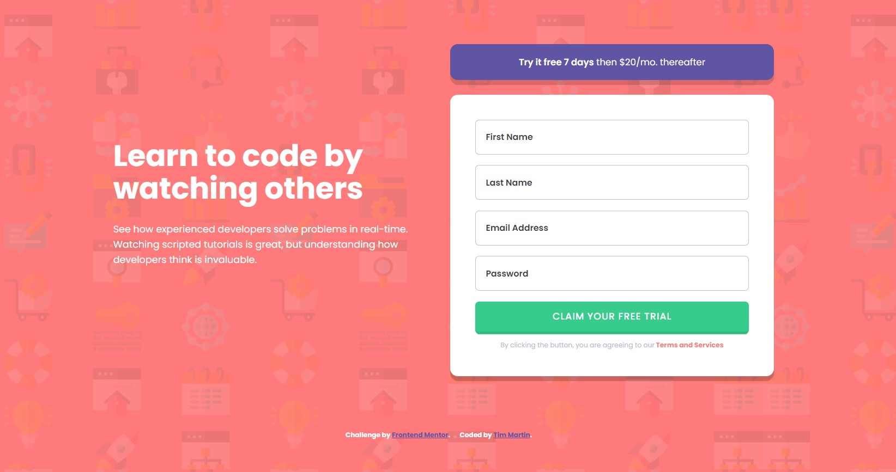
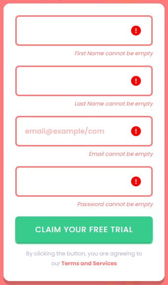

# Frontend Mentor - Intro component with sign up form solution

This is a solution to the [Intro component with sign up form challenge on Frontend Mentor](https://www.frontendmentor.io/challenges/intro-component-with-signup-form-5cf91bd49edda32581d28fd1). Frontend Mentor challenges help you improve your coding skills by building realistic projects.

## Table of contents

- [Overview](#overview)
  - [The challenge](#the-challenge)
  - [Screenshot](#screenshot)
  - [Links](#links)
- [My process](#my-process)
  - [Built with](#built-with)
  - [What I learned](#what-i-learned)
  - [Continued development](#continued-development)
  - [Useful resources](#useful-resources)
- [Author](#author)

## Overview

### The challenge

Users should be able to:

- View the optimal layout for the site depending on their device's screen size
- See hover states for all interactive elements on the page
- Receive an error message when the `form` is submitted if:
  - Any `input` field is empty. The message for this error should say _"[Field Name] cannot be empty"_
  - The email address is not formatted correctly (i.e. a correct email address should have this structure: `name@host.tld`). The message for this error should say _"Looks like this is not an email"_

### Screenshot

Desktop Layout



Mobile Layout


Error states



Button hover state


### Links

- Solution URL: [Frontend Mentor](https://www.frontendmentor.io/solutions/intro-component-sign-up-using-reactstyled-components-FI0bSnBx7I)
- Live Site URL: [Github Pages](https://timmartin13-frontend-mentor.github.io/intro-component-sign-up/)

## My process

### Built with

- Semantic HTML5 markup
- Flexbox
- Mobile-first workflow
- [React](https://reactjs.org/) - JS library
- [Styled Components](https://styled-components.com/) - For styles

### What I learned

I learned a lot about styling inputs and handling form validation along with React useState().

The styled Input components

```css
export const Input = styled.input`
  width: 100%;
  padding: 1.05rem;
  font-family: 'Poppins', sans-serif;
  font-size: 0.9rem;
  font-weight: 600;
  border: ${(props) => (props.error ? '3px' : '1px')} solid
    ${(props) => (props.error ? props.theme.red : props.theme.lightGrey)};
  border-radius: 0.4rem;
  margin-bottom: 1.1rem;
  box-sizing: border-box;
  color: ${(props) => (props.error ? props.theme.red : props.theme.darkBlue)};

  &::placeholder {
    color: ${(props) => (props.error ? props.theme.red : props.theme.darkBlue)};
  }
`;
```

State variable for first name field

```js
const [firstName, setFirstName] = useState({
  name: '',
  error: false,
  errorMessage: 'First Name cannot be empty',
});
```

Checking two different validations type for the email address

```js
if (!email.address) {
  setEmail({
    ...email,
    error: true,
    errorMessage: 'Email cannot be empty',
  });
} else if (validEmail(email.address)) {
  setEmail({
    ...email,
    error: true,
    errorMessage: 'Looks like this is not an email',
  });
}
```

The Input component in React

```js
{
  /* First Name */
}
<InputWrapper>
  <Input
    type='text'
    name='firstName'
    placeholder={firstName.error ? '' : 'First Name'}
    value={firstName.name}
    onChange={(e) =>
      setFirstName({ ...firstName, name: e.target.value, error: false })
    }
    error={firstName.error}
  />
  {/* Exclamation point on error */}
  {firstName.error ? <AlertIcon /> : ''}
</InputWrapper>;
{
  /* Error text */
}
{
  firstName.error ? <Alert message={firstName.errorMessage} /> : '';
}
```

### Continued development

I am going to continue to focus on React because I want to learn it very well before moving onto something else. I am going to try to expand my knowledge of JavaScript so that I can make applications more interactive and fun.

### Useful resources

- [Hosting React on Github pages](https://www.c-sharpcorner.com/article/how-to-deploy-react-application-on-github-pages/) - This helped me to get my React app up on github pages
- [Styled Components](https://styled-components.com/) - This helped me understand more about how to use styled components

## Author

- Website - [My portfolio](https://timmartin13.github.io/react-portfolio/)
- Frontend Mentor - [@TimMartin13](https://www.frontendmentor.io/profile/TimMartin13)
